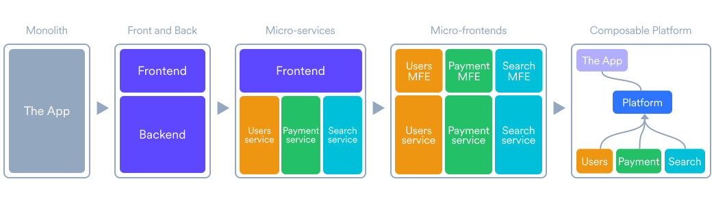
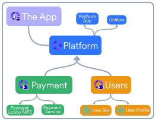
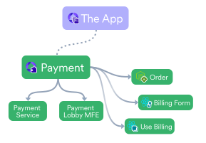
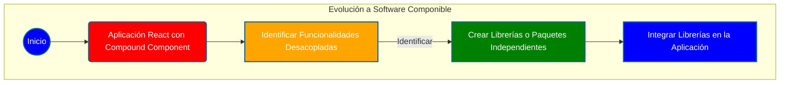
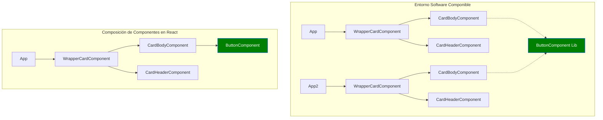
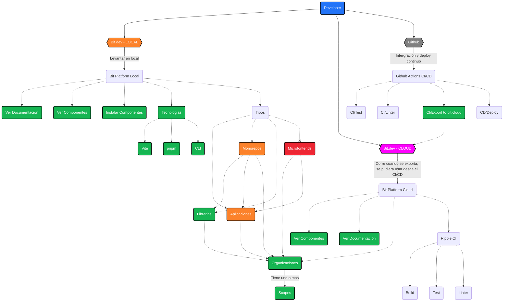
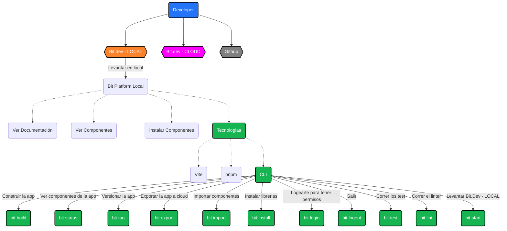
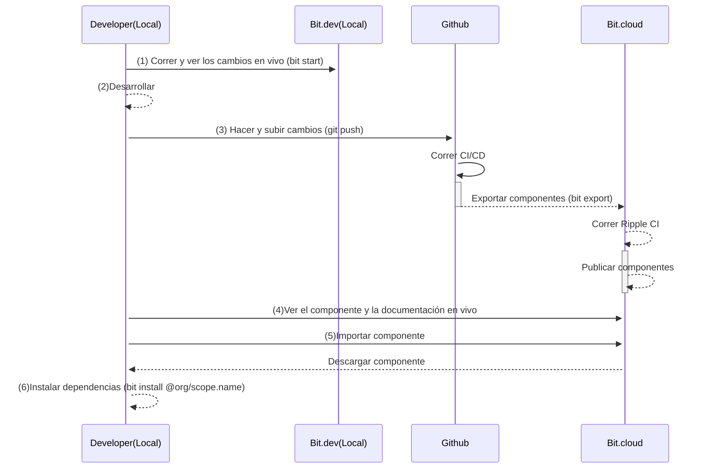
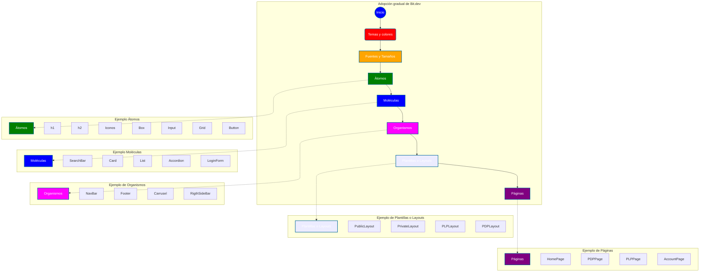

# Que es Bit.dev? 

* doc: https://bit.dev/
* github: https://github.com/teambit
* bit.cloud: https://bit.cloud/enterprise

Un sistema de creación de software de nueva generación para Software Descentralizado basado en Component Drive Development o Software Componible.

### 1- Bit es un sistema de compilación para software componible. 
* Hace que la composición de aplicaciones a partir de componentes con versiones independientes sea fluida y rápida.

### 2- La principal innovación de Bit es Bit Component 
* Bit Component es un contenedor para componentes de software componibles completamente desacoplado.

* Se puede considerar como un paquete de nueva generación.
* Es extensible, portátil y de fácil mantenimiento.

### 3- La gente suele utilizar Bit para: 
* Librerias
* Monorepo
* Polyrepo o Microrepo
* Microservicios
* Microfrontend

### 4- Bit está diseñado para una adopción incremental 
* Adopción incremental y se puede agregar a la mayoría de las bases de código en pocos minutos.

### 5- Bit nos abstrae del framework, empaquetador y administrador de paquetes.
* Bit nos abstrae del framework, empaquetador y administrador de paquetes lo que significa que puedes usarlo con cualquier marco de framework o librería, proporcionando plantillas para los marcos más populares y una CLI para los comando más comunes.

# Herramientas que soporta Bit.dev

 

 

# Ventajas de Bit.dev

# CLI de Bit.dev

# Flujo de trabajo de Bit.cloud

# Propueta de adopción gradual de Bit.dev

# Pros y Contras de Bit.dev
### Pros
* Es open source.
* Hace que la composición de aplicaciones a partir de componentes con versiones independientes sea fluida y rápida.
* El desacoplamiento hace que sea extensible, portátil y de fácil mantenimiento.
* La gente suele utilizar Bit para ejecutar una arquitectura: 
  * Librerias
  * Monorepo
  * Polyrepo o Microrepo
  * Microservicios
  * Microfrontend
* Bit nos abstrae del framework, empaquetador y administrador de paquetes lo que significa que puedes usarlo con cualquier marco de framework o librería, proporcionando plantillas para los marcos más populares y una CLI para los comando más comunes.
* Posibilidad de incrustar figma al lado del componente.
* Posibilidad de documentar el componente usando storybook o Markdown eXtended.
* Contiene Ripple CI que es un sistema de CI que se ejecuta en la nube para asegurarnos que el componente funciona correctamente.
* Contiene auto-tagging que es un sistema de versionamiento automático.
* Nos permite ver analíticas de uso de los componentes y un gráfico de dependencias.

### Contras
* Bit.dev es una herramienta muy nueva.
* Bit.dev es una herramienta un poco compleja de aplicar en proyectos ya iniciados.
* Bit.dev tiene una documentación no muy explicita.
