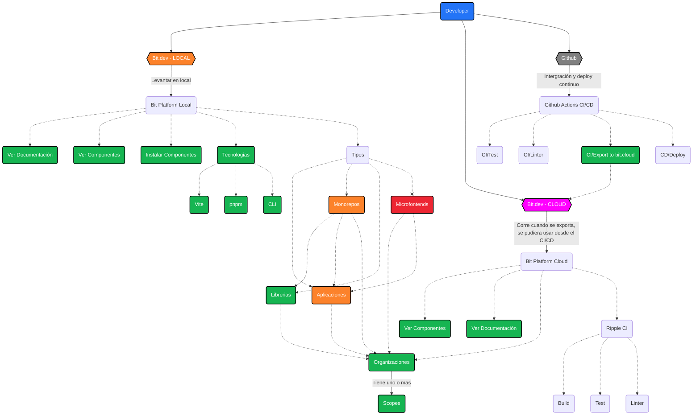
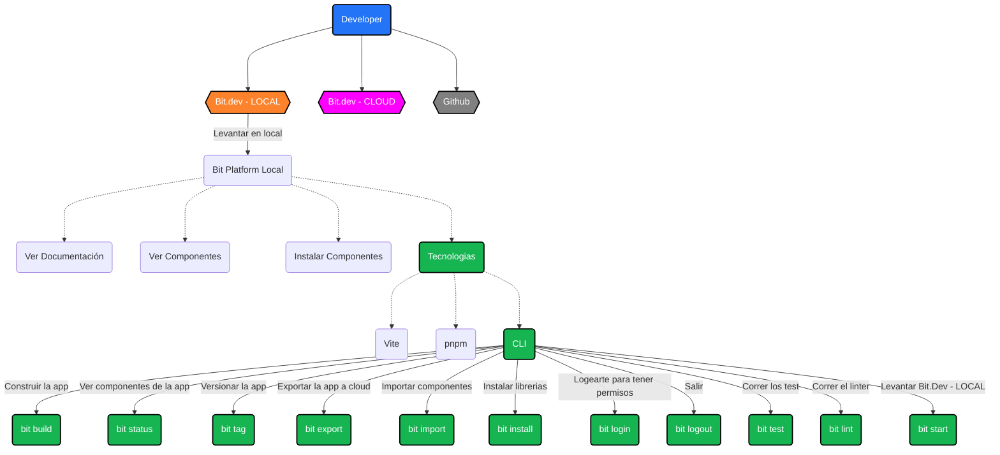

# Ventajas de Bit.dev

```mermaid
flowchart TB
   %% Colors %%
    classDef blue fill:#2374f7,stroke:#000,stroke-width:2px,color:#fff
    classDef orange fill:#fc822b, stroke:#000, stroke-width:2px, color:#fff
    classDef green fill:#16b552, stroke:#000, stroke-width:2px, color:#fff
    classDef red fill:#ed2633, stroke:#000, stroke-width:2px, color:#fff
    classDef magenta fill:magenta, stroke:#000, stroke-width:2px, color:#fff
    classDef gray fill:gray, stroke:#000, stroke-width:2px, color:#fff
    classDef yellow fill:yellow, stroke:#000, stroke-width:2px, color:#000

    %% Nodos %%
    Dev(Developer):::blue
    BL{{Bit.dev - LOCAL}}:::orange
    BC{{Bit.dev - CLOUD}}:::magenta
    G{{Github}}:::gray

    Dev ---> BL
    Dev ---> BC
    Dev ---> G
%%    BL -..-> BC

    BL --"Levantar en local"-->
                                PL(Bit Platform Local) -..-> DocPL(Ver Documentación):::green
                                PL                     -..-> ComPL(Ver Componentes):::green
                                PL                     -..-> InsPL(Instalar Componentes):::green
                                PL                     -..-> PLT(Tecnologias):::green
                                                             PLT                    -..-> VitePL(Vite):::green
                                                             PLT                    -..-> PnpmPL(pnpm):::green
                                                             PLT                    -..-> CLIPL(CLI):::green

                                                             
                                PL                     -..-> TiposPL(Tipos)
                                                             TiposPL -..-> VarComPL(Aplicaciones):::orange-..-> OrgBC(Organizaciones):::green
                                                             TiposPL -..-> MonComPL(Monorepos):::orange-..-> LibComPL(Librerias):::green
                                                                           MonComPL(Monorepos):::orange-..-> VarComPL(Aplicaciones):::orange
                                                                           MonComPL(Monorepos):::orange-..-> OrgBC(Organizaciones):::green
                                                             TiposPL -..-> LibComPL(Librerias):::green-..-> OrgBC(Organizaciones):::green
                                                             TiposPL -..-x MicrofComPL(Microfontends):::red-..-> OrgBC(Organizaciones):::green
                                                                           MicrofComPL(Microfontends):::red-..-> VarComPL(Aplicaciones):::orange
                                                             
                                                             
                                
                                
    BC --"Corre cuando se exporta, se pudiera usar desde el CI/CD "--> 
                                      PC(Bit Platform Cloud) -..-> ComBC(Ver Componentes):::green
                                      PC                     -..-> DocBC(Ver Documentación):::green
                                      PC                     -..-> OrgBC(Organizaciones):::green --"Tiene uno o mas"--> ScopBC(Scopes):::green
                                      PC                     -..-> Ci(Ripple CI) -..-> BB(Build)
                                                                   Ci -..-> TBC(Test)
                                                                   Ci -..-> LBC(Linter)

    G --"Intergración y deploy continuo"-->  GA(Github Actions CI/CD)
                                             GA -..-> Test(CI/Test)
                                             GA -..-> Lint(CI/Linter)
                                             GA -..-> Export(CI/Export to bit.cloud):::green -..-> BC
                                             GA -..-> Dep(CD/Deploy)
```

# CLI de Bit.dev

```mermaid
flowchart TB
   %% Colors %%
    classDef blue fill:#2374f7,stroke:#000,stroke-width:2px,color:#fff
    classDef orange fill:#fc822b, stroke:#000, stroke-width:2px, color:#fff
    classDef green fill:#16b552, stroke:#000, stroke-width:2px, color:#fff
    classDef red fill:#ed2633, stroke:#000, stroke-width:2px, color:#fff
    classDef magenta fill:magenta, stroke:#000, stroke-width:2px, color:#fff
    classDef gray fill:gray, stroke:#000, stroke-width:2px, color:#fff
    classDef yellow fill:yellow, stroke:#000, stroke-width:2px, color:#000

    %% Nodos %%
    Dev(Developer):::blue
    BL{{Bit.dev - LOCAL}}:::orange
    BC{{Bit.dev - CLOUD}}:::magenta
    G{{Github}}:::gray

    Dev ---> BL
    Dev ---> BC
    Dev ---> G
    BL --"Levantar en local"-->
                                PL(Bit Platform Local) -..-> DocPL(Ver Documentación)
                                PL                     -..-> ComPL(Ver Componentes)
                                PL                     -..-> InsPL(Instalar Componentes)
                                PL                     -..-> PLT(Tecnologias):::green
                                PLT                    -..-> VitePL(Vite)
                                PLT                    -..-> PnpmPL(pnpm)
                                PLT                    -..-> CLIPL(CLI):::green
CLIPL                    --"Construir la app"--> BUILDPL(bit build):::green
CLIPL                    --"Ver componentes de la app"--> STATUSDPL(bit status):::green
CLIPL                    --"Versionar la app"--> TAGPL(bit tag):::green
CLIPL                    --"Exportar la app a cloud"--> EXPORTPL(bit export):::green
CLIPL                    --"Importar componentes"--> IMPORTPL(bit import):::green
CLIPL                    --"Instalar librerias"--> INSTALLPL(bit install):::green
CLIPL                    --"Logearte para tener permisos"--> LOGINPL(bit login):::green
CLIPL                    --"Salir"--> LOGOUTPL(bit logout):::green
CLIPL                    --"Correr los test"--> TESTPL(bit test):::green
CLIPL                    --"Correr el linter"--> LINTERPL(bit lint):::green
CLIPL                    --"Levantar Bit.Dev - LOCAL"--> BITDEVLOCALPL(bit start):::green
```
