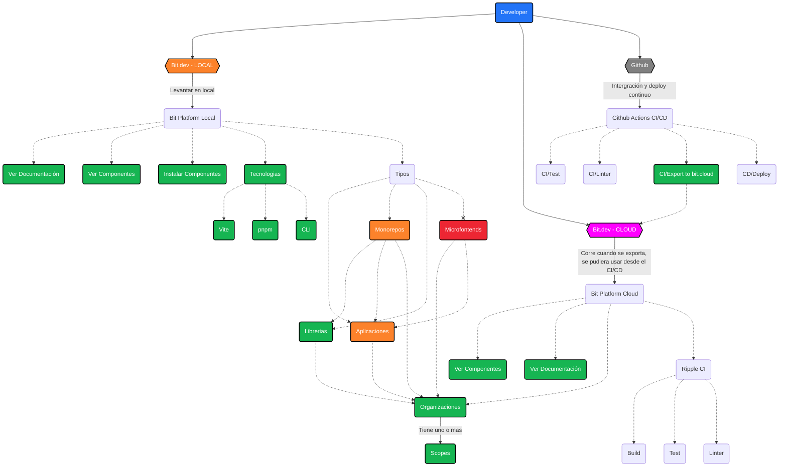
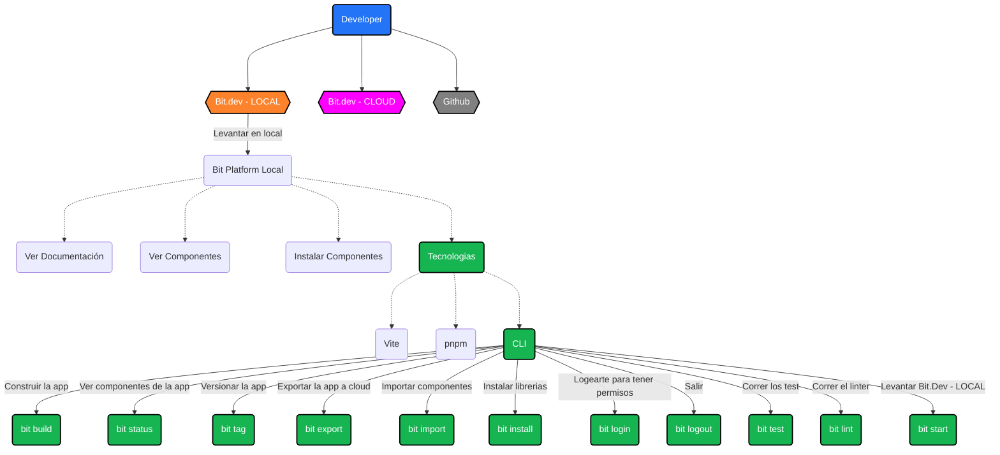

# Que es Bit.dev? 

### 1- Bit es un sistema de compilación para software componible. 
* Hace que la composición de aplicaciones a partir de componentes con versiones independientes sea fluida y rápida.

### 2- La principal innovación de Bit es Bit Component 
* Un contenedor para componentes de software componibles completamente desacoplado. 
* Puedes considerarlo como un paquete de próxima generación. 
* Es extensible, portátil y de fácil mantenimiento.

### 3- La gente suele utilizar Bit para ejecutar una arquitectura: 
* Monorepo
* Polyrepo o Microrepo
* Distribuida

### 4- Bit está diseñado para una adopción incremental 
* Adopción incremental y se puede agregar a la mayoría de las bases de código en pocos minutos.

### 5- Bit es agnóstico del framework, empaquetador y administrador de paquetes.
* Bit es agnóstico del framework, empaquetador y administrador de paquetes lo que significa que puedes usarlo con cualquier marco de framework o librería.

# Herramientas que soporta Bit.dev

 

 

# Ventajas de Bit.dev

# CLI de Bit.dev

